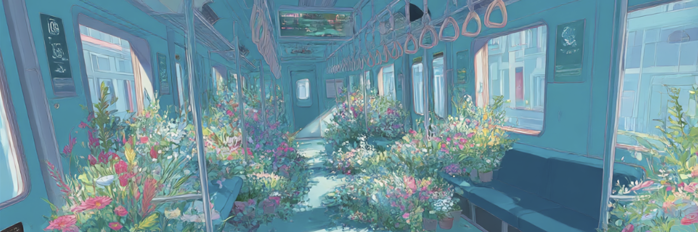

## [Dreamcore-Experiment](https://keli95566.github.io/dreamcore-experiment/)

 

> Do people dream to imagine the impossible, or do they dream because the impossible is already within them?  

> Why do I feel like I have been to this place before, despite I know it is not real?

Human brain is capable of reconstructing entirely their own version of "virtual reality" from 
just a small piece of information, be it from a piece of music, an appealing image, a piece of poem, or from a random sensory stimulus. 

Nowadays, with technology like [World Lab Marble](https://marble.worldlabs.ai/), computer is capable of doing so as well. 

While generative AI hallucinate, don't humans do the same when they dream? 

``Dreamcore-Experiment`` is my personal artistic exploration, where I seek to experiment with the rapid advancement of generative AI tools and explore to what extent computer graphics and AI technology can reconstruct and represent human dreams and imagination in 3D environments.

### Technical Details

In this demo, I used a MidJourney-generated image as a prompt for [World Lab Marble](https://marble.worldlabs.ai/), which reconstructs the scene in 3D using a Gaussian splatting model.  

I extended the [Spark](https://github.com/sparkjsdev/spark ) shaders to create wave-like noise, making the splat scene appear more dynamic.  

For audio, I used Eleven Labs to generate calm, dreamcore-style music and developed a basic music analyzer to subtly control the intensity of the wave lighting effect.

 

### Run Dreamcore sample locally

You could try a web demo directly [here](https://keli95566.github.io/dreamcore-experiment/). Notice that splat loading might take a while to load. 

If you want to run locally,  make sure you have ``Node.js`` and ``npm`` installed on your system, and: 

- run ``npx serve``
- view sample in browser at ``http://localhost:3000``

### Using your own 3D world and music

- Put your files into the corresponding folder in  ``.\resources\``. 

- Change the file path in ``main.js`` (Line 25 for splat, line 73 for music).